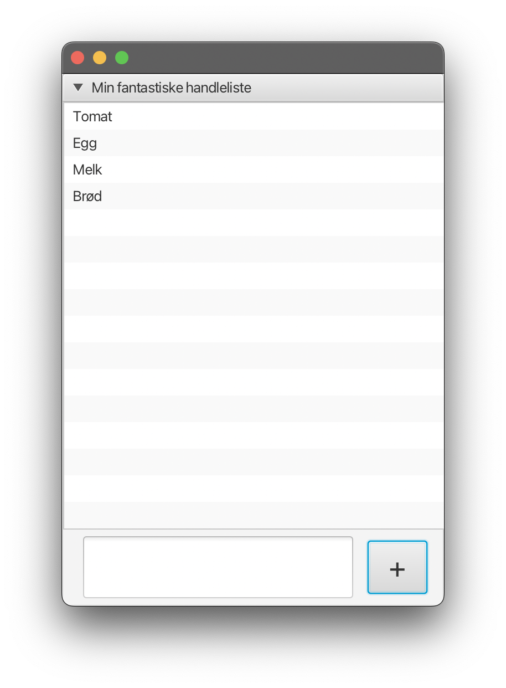
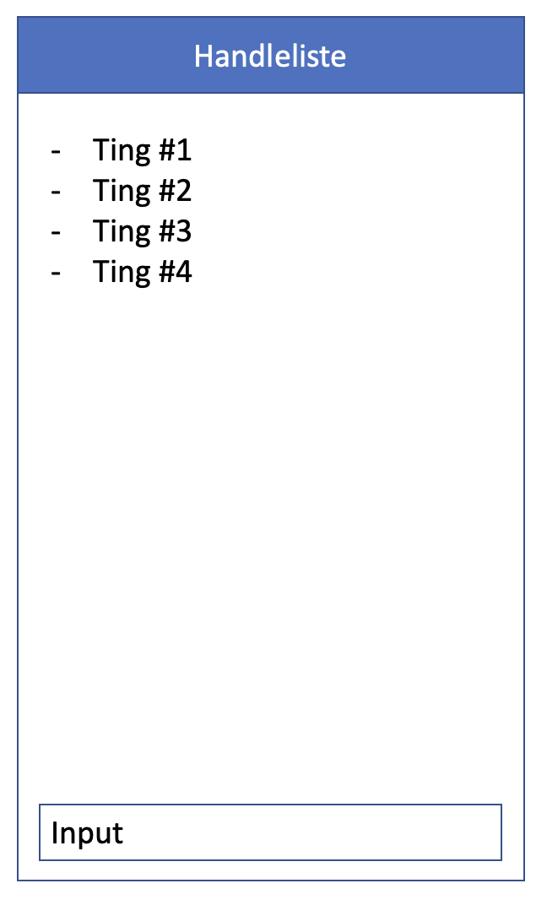

# Description of project
This application is meant to be an implementation of a real life shopping list, with a few additions. An issue with a real life shopping list is that you are unable access your information from multiple places. This application is meant to solve that problem by providing a reliable and convenient way to store your shopping lists, as well as share them with others.

## The application is meant to enable you to:
 - Manage multiple shopping lists
 - Create, read, update and delete items in shopping lists
 - Create, read, update and delete shopping lists
 - Share shopping lists with others
 - Access the shopping list from multiple devices by fetching data from an API
 - Persist shopping lists both in local storage and cloud storage

 
 

 ## First development sprint: Create basic item list functionality
During this period we developed a ui using JavaFX, as well as the underlying core functionality for adding items to an existing list. This includes JSON file management. The source files were organized into three separate packages; "core", "ui" and "json". More information can be found under the [documentation](../docs/release1.md).

The above provided illustration shows the first iteration of our project.

During this sprint we took consideration of [user story #1](../Userstories.md). We specifically wanted to satisfy the first and most important acceptance-criteria. This being the ability to add items to a list in a simple manner.

 # Planning

The app was planned to follow the Model-View-Controller principles.

 ## Model
 ### First sketch
This was our first sketch of the model:

AppData class:
	List<ShoppingList> shoppinglists;
    ShoppingList activeShoppingList;

ShoppingList class:
	List<Item> items;
	String Name;
	int id; (Scaleability)

Item class:
	String name;
    int id;

 ### Changes
We ended up with adding a String filename field to AppData to in the future be able to not have to hardcode savepath.

ShoppingLists List<Item> items field turned into a HashMap to be able to lookup items in constant time. 

Item added an isCollected field to be able to check off the item in the future, but this feature isn't implemented yet. Also added listen

Added listener field to ShoppingLists and Item to be able to update relevant parties. Also changed int id to UUID id to make use of UUID library benefits.

 ## View
 ### Original idea

 ### Implementation

 ## Controller
As the controller in 

 # Documentation
 

 ## Introduction
The purpose of this application is to help users keep track of what items they wish to buy. This is implemented by utilizing technologies such as JavaFX for GUI, and JSON for managing data.

 ## Organization of packages
The apps structure is divided into packages in such a way, that each package is responsible for specific parts the apps functionality. These packages consists of core, ui, and json

- core - classes of which handles the logic behind the shoppinglist. 
- ui - The applications user interface, which is 
- json - classes of which handles storing data persistently, such that the users data is not lost when shutting down the application, and is retreived once the user opens the app after closing.

 ## Assessing the code quality
The apps quality is assessed by utilizing jacoco. As a result, we are given a quantified report of the test coverage.

 ## JSON save format for shoppinglist
The app utilizes the GSON library and its GSON class with its toJSON and fromJSON functions to deserialize and serialize the top level object containing the different shoppinglists. Certain properties of Item and ShoppingList classes are hidden using the transient property to avoid circular references and stackoverflow errors. 

You can use the JSONReader class to get an object with the properties described in JSON. Use the JSONReader class by making an object o of JSONReader and then running (c) o.read(c.class) where c is the class of the object you want returned. 

You can use the JSONWriter class to write an object to JSON. Use the JSONWriter class to save an object o by making an object p of JSONWriter and then running p.write(o).

 ## Class structure
The class structure is so that you have a top level AppData class which can have one or more ShoppingList children. Each ShoppingList can have zero or more Item children. The ShoppingList is also a listener to the Item and both AppController and AppData are listeners to shoppinglist. What this means is that a change at the bottom Item level will propagate upwards to AppData and AppController to save the new state to file and to update the view.